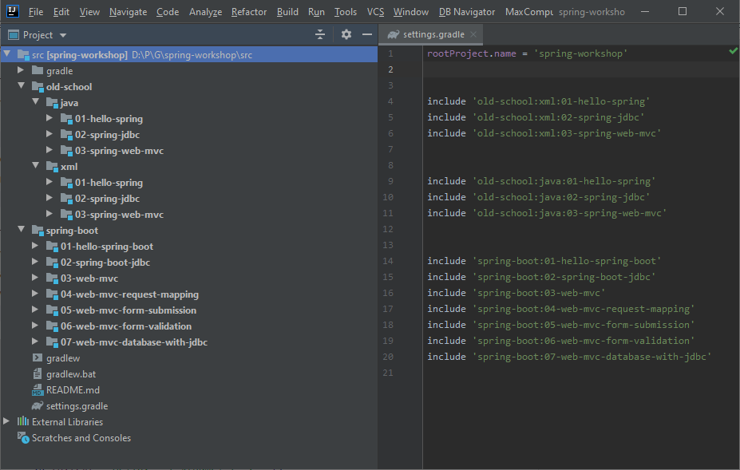

```
   _____            _                _       __           __        __                
  / ___/____  _____(_)___  ____ _   | |     / /___  _____/ /_______/ /_  ____  ____   
  \__ \/ __ \/ ___/ / __ \/ __ `/   | | /| / / __ \/ ___/ //_/ ___/ __ \/ __ \/ __ \ 
 ___/ / /_/ / /  / / / / / /_/ /    | |/ |/ / /_/ / /  / ,< (__  ) / / / /_/ / /_/ / 
/____/ .___/_/  /_/_/ /_/\__, /     |__/|__/\____/_/  /_/|_/____/_/ /_/\____/ .___/   
    /_/                 /____/                                             /_/        

|^ /? /\ \/ [- [- |\|   (_, /\ |\| |) |-| |   |^
```

[](https://opensource.org/licenses/MIT)
[](https://spring.io/)
[](https://in.linkedin.com/in/praveengandhi)
[](https://techiteasypolicy.blogspot.com/)



## Old school Spring applications
-[x] XML configuration
  1. Hello Spring
  2. Spring JDBC
  3. Spring MVC
-[x] Java Configurtion
  1. Hello Spring
  2. Spring JDBC
  3. Spring MVC
## Spring-boot applications
1. Hello Spring-boot
2. JDBC with H2 database
3. Web MVC hello-world
4. Request Mapping
5. Form submission
6. Form validation
7. Web application with Database (JDBC)

_**Database applications are using [H2 database](https://h2database.com/) for simplicity. These can be switched to any JDBC complaint Database**_

_jdbc:h2:tcp://localhost:1510/./spring-workshop_

_jdbc:h2:file:./spring-workshop_

# To build and run

```shell script
gradlew projects
gradlew build

#to run individual application (for example)
gradlew :old-school:xml:01-hello-spring:run
gradlew :old-school:xml:03-spring-web-mvc:appRun
gradlew :spring-boot:01-hello-spring-boot:bootRun
```

# Next steps (live):

- [Building ReST application](https://spring.io/guides/gs/rest-service/)
- [Spring Projects overview](https://spring.io/projects)
- [Spring Data ReST](https://spring.io/projects/spring-data-rest)
- [Spring Data JDBC](https://spring.io/projects/spring-data-jdbc) Live Project code walk through
- Legacy Spring application sample

